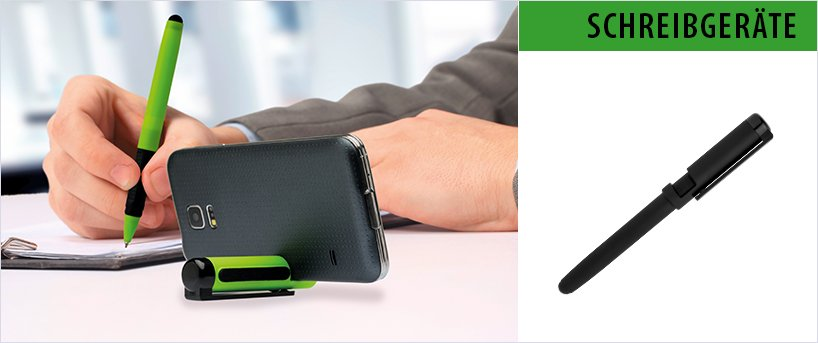
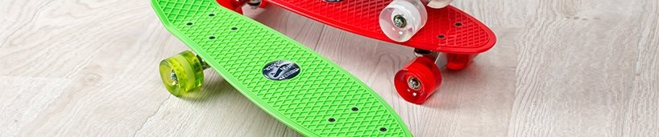
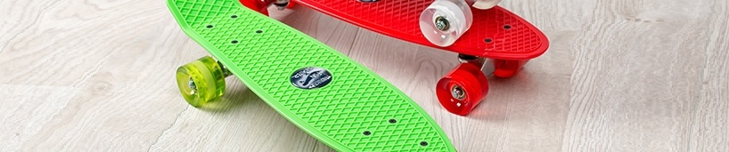
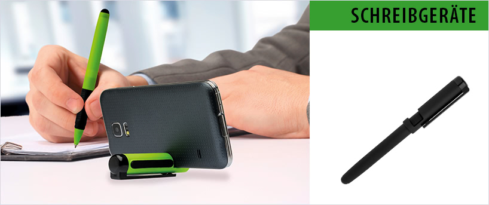

#Based on [google pagespeed insights](https://developers.google.com/speed/pagespeed/insights/?url=https:%2F%2Fgithub.com%2Ftinect%2Foptimizertest%2Fblob%2Fmaster%2Findex.md&tab=desktop)

>I would suggest, to use optimus.io, but just, if there aren't much images with texts in it

##Test 1 - with Text
###Original 139KB - could save 74%:

###guetzli 54KB - could save <b>17%:</b>

###optimus.io 36KB - could save <b>0%:</b>

###Tinypng 74KB - could save 52%:

###Kraken lossless 130KB - could save 72%:

###Kraken lossy 51KB - could save 31%:

###kraken quality 90 chroma: 4:4:4 55KB - could save 31%:

###imagify.io 131KB - could save 73%:

##Test 2 - just image

###Original 134KB - could save 73%:

###guetzli 55KB - could save 11%:</b>

###optimus.io 36KB - could save <b>0%</b>:

###Tinypng 75KB - could save 52%:

###Kraken lossless 119KB - could save 70%:

###Kraken lossy 63KB - could save 45%:

###kraken quality 90 chroma: 4:4:4 54KB - could save 30%:

###imagify.io 121KB - could save 70%:

##Test 3 - PNG and Text
>google seems to accept all sizes with PNGs.
###Original 255KB - could save 0%:

###guetzli 59KB - could save 0%:
>Guetzli generates JPG, so no alpha is possible.

###optimus.io 241KB - could save 0%:

###Tinypng 73KB - could save 0%:

###Kraken lossless 244KB - could save 0%:

###Kraken lossy 74KB - could save 0%:

###kraken quality 90 chroma: 4:4:4 244KB - could save 0%:

###imagify.io 242KB - could save 0%:

